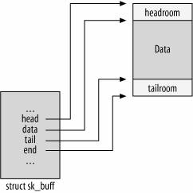
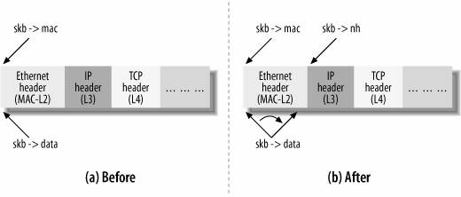
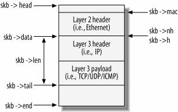
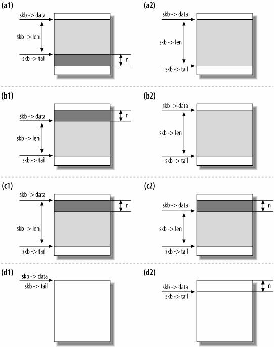

<!-- TOC -->

- [skbuff基础结构](#skbuff基础结构)
    - [data, head, tail, end字段](#data-head-tail-end字段)
    - [skbuffdatat类型](#skbuffdatat类型)
    - [收包过程中指针的移动](#收包过程中指针的移动)
- [实现自定义l3协议](#实现自定义l3协议)
    - [l3协议的注册和注销](#l3协议的注册和注销)
    - [ethhdr/skbnetworkheader/skbpush/skbpull](#ethhdrskbnetworkheaderskbpushskbpull)

<!-- /TOC -->

linux内核网络模块通过skbuff数据结构存储发送和接收的数据包。它的数据结构讲解可以参考Understanding Linux Network Internals这本书的第二章[The Socket Buffer: sk_buff Structure](http://www.embeddedlinux.org.cn/linux_net/0596002556/understandlni-CHP-2-SECT-1.html])。这篇文章记录书中提到的几个重要的点，并结合笔者写的虚拟网卡驱动的实际例子解释其中的一些原理。

# 1. skbuff基础结构

下面是skbuff结构在内核中的定义

```c
// 这里省略了很多字段，仅包含一些基础的位置字段和layer层字段
struct sk_buff {
	unsigned int		len,
				data_len;

	union {
		__wsum		csum;
		struct {
			__u16	csum_start;
			__u16	csum_offset;
		};
	};
	
	sk_buff_data_t		inner_transport_header;
	sk_buff_data_t		inner_network_header;
	sk_buff_data_t		inner_mac_header;
	sk_buff_data_t		transport_header;
	sk_buff_data_t		network_header;
	sk_buff_data_t		mac_header;
	/* These elements must be at the end, see alloc_skb() for details.  */
	sk_buff_data_t		tail;
	sk_buff_data_t		end;
	unsigned char		*head,
				*data;
};
```

## 1.1. data, head, tail, end字段



skbuff通过一段连续的内存段存储数据包，head和end字段指向了skbuff的开始和结束的内存地址，任何层的数据都不会超过这个范围。data和tail指向了当前已经写入了数据的范围。

## 1.2. sk_buff_data_t类型

内核为了节省skbuff的内存，将除了head/data指针的值在64位系统中定义位了int型，int型只需要指针内存的一半(4取代8字节)，那么这个结构节省32个字节。

```c
#if BITS_PER_LONG > 32
#define NET_SKBUFF_DATA_USES_OFFSET 1
#endif

#ifdef NET_SKBUFF_DATA_USES_OFFSET
typedef unsigned int sk_buff_data_t;
#else
typedef unsigned char *sk_buff_data_t;
#endif
```

## 1.3. 收包过程中指针的移动

书中在第2章介绍接收包的处理流程中举了下面的例子：



> When receiving a data packet, the function responsible for processing the layer n header receives a buffer from layer n-1 with skb->data pointing to the beginning of the layer n header. The function that handles layer n initializes the proper pointer for this layer (for instance, skb->nh for L3 handlers) to preserve the skb->data field, because the contents of this pointer will be lost during the processing at the next layer, when skb->data is initialized to a different offset within the buffer. The function then completes the layer n processing and, before passing the packet to the layer n+1 handler, updates skb->data to make it point to the end of the layer n header, which is the beginning of the layer n+1 header (see Figure 2-3).

这段话的含义如图中所示，在l2 mac层的收包函数处理完l2的工作之后，在将包传给l3收包函数处理之前，会将skb->data指针指向l3包头的开始地址处。

这是书中19章介绍ip层收包的流程时，介绍的在ip_rcv接收包之时，各指针的位置情况，书中这个图更加的清晰。



这里图中结合文字的描述已经很清晰了，但是实际在从事内核源码工作时如果没有这方面的知识，或者看书后忘记了这个过程，可能就会犯错，导致网络不通。下面以笔者写虚拟网卡驱动的一个例子，讲解下这个过程。

# 2. 实现自定义l3协议

笔者在自己写的虚拟网卡模块中注册了一种新的l3协议ipo，将tcp/udp等l3层数据封装在ipo里面，在该协议收包的时候要将ipo部分删除，然后通过移动skbuff中的若干指针继续tcp/udp等协议的处理流程。

## 2.1. l3协议的注册和注销

笔者的协议的位置是这样的：

```
|<--mac-->|<--ip-->|<--ipo-->|<--tcp/udp/icmp-->|
```

注册一种新的l3协议很简单：

```c

// 定义l3协议号，这里143是一个还未被使用的protocol，具体可以查询 https://www.iana.org/assignments/protocol-numbers/protocol-numbers.xhtml
const int IPPROTO_IPO = 143;

// 定义l3协议的处理函数，net_protocol
static const struct net_protocol net_ipo_protocol = {
	.handler     = ipo_rx,
	.err_handler = ipo_err,
	.netns_ok    = 1,
	.no_policy = 1,
};

// 在自己内核模块的初始化函数中增加注册代码
if (inet_add_protocol(&net_ipo_protocol, IPPROTO_IPO) < 0) {
	pr_err("can't add protocol\n");
	return -EAGAIN;
}

// 在卸载函数中增加注销代码
inet_del_protocol(&net_ipo_protocol, IPPROTO_IPO);
```

在ipo_rx函数中接收到l3数据包时，笔者打印了一番这些指针的值

```c
nh = (struct iphdr *)skb_network_header(skb);
pr_debug("IPO ipo_rx head %p, tail %d, data %p, end %d, len %u, headroom %d, mac %d, network %d, transport %d, ip payload len %d\n",
	   skb->head, skb->tail, skb->data, skb->end, skb->len, skb_headroom(skb), skb->mac_header, skb->network_header, skb->transport_header, ntohs(nh->tot_len));

// 结果为
[二 1月  7 17:30:32 2020] IPO ipo_rx head ffff93d5a505c780, tail 134, data ffff93d5a505c7e2, end 192, len 36, headroom 98, mac 64, network 78, transport 98, ip payload len 56
```

tail/data/end/mac/network/transport这些指针之所以是int型的是因为笔者的虚拟机是64位的，在32位时这些指针应该是地址。

通过计算发现，打印的这些值的位置恰好与19章图的描述基本一致，除了data指针（0xffff93d5a505c7e2-0xffff93d5a505c780=98）指向了transport的开始，len只包含了l3的大小，因为ipo是三层协议。

剥离ipo的处理流程如下，笔者首先将ip层的total length字段减去ipo头的长度，将数据ip头向后移动了overhead个字段，再将data/network/transport指针复位，最后重新计算校验和。

```c
// 删掉ipo头，将ip头平移到ipo的位置

|<--mac-->|<--ip-->|<--ipo-->|<--tcp/udp/icmp-->|

    ||
    \/

|<--mac-->|<------->|<--ip-->|<--tcp/udp/icmp-->|

// opthdr is the header of my ipo protocol
const unsigned short overhead = sizeof(struct opthdr);
struct iphdr *nh = (struct iphdr *)skb_network_header(skb);
nh->tot_len = htons(ntohs(nh->tot_len) - overhead);
// move IP header behind
memmove(skb_network_header(skb) + overhead, skb_network_header(skb), sizeof(struct iphdr));
// skb_pull moves skb->data ahead
skb_pull(skb, overhead);
// skb_reset_transport_header resets skb->transport = skb->data which moves transport ahead overhead bytes
skb_reset_transport_header(skb);
// skb_push moves skb->data back a iphdr length, so we can put the packet into ip stack via netif_rx
skb_push(skb, sizeof(struct iphdr));
// skb_reset_network_header resets skb->network = skb->data which moves network ahead overhead bytes
skb_reset_network_header(skb);
nh = (struct iphdr *)skb_network_header(skb);
ip_send_check(nh);

skb_scrub_packet(skb, true);
// put packet into ip layer
netif_rx(skb);
```

下面分别介绍下这里的一些操作

## 2.2. eth_hdr/skb_network_header/skb_push/skb_pull

由于sk_buff_data_t类型在32/64位差异的引入，在读写这些指针时最好都使用skbuff.h中已经定义好的函数，否则要自己处理这个差异。

```
// 获取mac头
struct ethhdr *mac = (struct ethhdr*) eth_hdr(skb);
// 获取ip头
struct iphdr *nh = (struct iphdr *)skb_network_header(skb);

// 发包时写入数据结束后将data指针向上移动
skb_push(skb, sizeof(struct xxx));
// 收包时处理完本层的逻辑后，将data指针向下移动
skb_pull(skb, sizeof(struct xxx));
```

书中2-4节的图. Before and after: (a)skb_put, (b)skb_push, (c)skb_pull, and (d)skb_reserve


